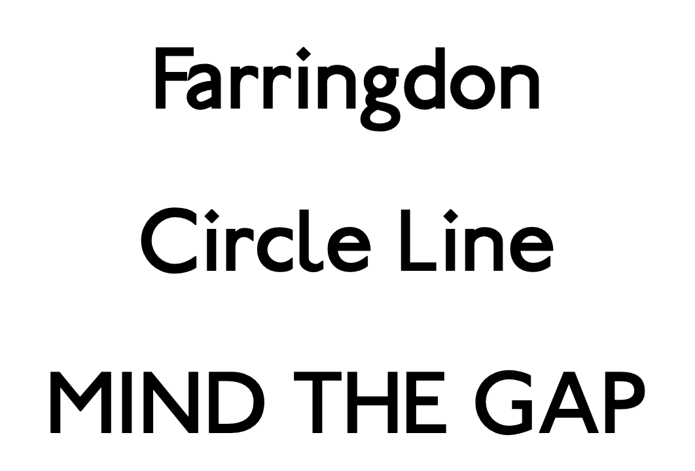
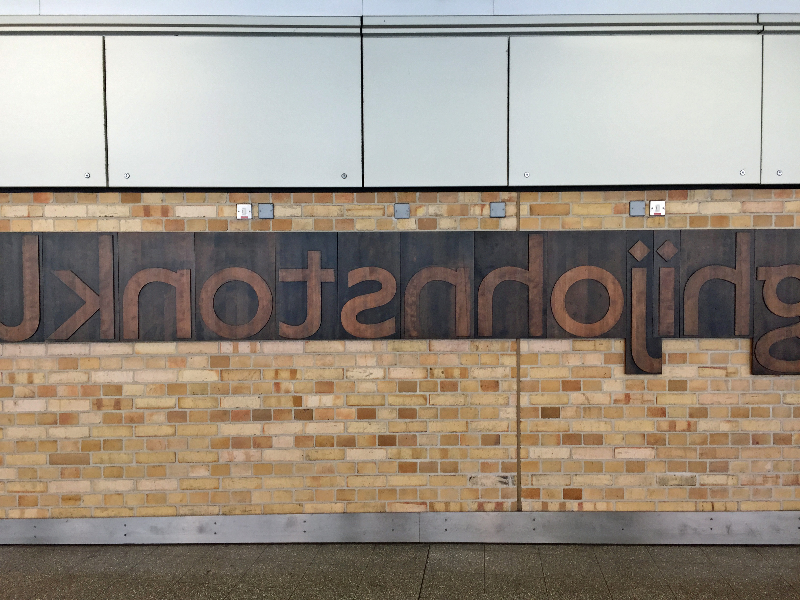

# Farringdon
Transport for London™’s iconic Johnston™ but free! [Click here to download.](https://github.com/ezgranet/farringdon/blob/main/farringdon.zip?raw=true)

## Detail
Edward Johnston’s legendary hand-lettered forms, which are perhaps the height of English craft design, surpassing even ([as others have also argued](https://www.typotheque.com/articles/re-evaluation_of_gill_sans)), are about as suggestive of London and Britain as ‘Mind the Gap’ of the Changing of the Guard.  Although an excellent digitised version from ITC™ exists, a free version of his designs can only serve to help the world of typography.  Fortunately, Stephen Moye (famed as the author of *Fontographer*) created just such a digitised version decades ago, in the earlier more innocent days of the internet, and released it into the world, under the properly London name of Paddington.  Regrettably (and through no fault of my illustrious predecessor), the versions floating around on font hosting sites have numerous flaws in their metadata and are slightly suspect.  To make the world slightly nicer, I have, using at its core Mr Moye’s superb work, incorporated advances in fonts.  For example, Mr Moye provided small capital shapes for both the bold and roman fonts, but these were done as separate font-files; I instead created a standard OpenType `+smcp` lookup.  I also incorporated, to fill in gaps in the coverage in Mr Moye's admirable but (by modern Unicode standards) sparse character set; as a result, in the Roman face only, I was able to incorporate under the terms of the Open Font Licence characters and ligatures from Railway Sans by Greg Fleming and from Hammersmith One by Nicole Fally.   The result is that the most extensive feature set and character coverage are to be found in the roman and bold fonts (with the former having the best), which is actually quite fitting as Johnston never designed an italic for this face (such was added later first by ITC, I believe).
## Nomenclature
The name of the typeface is taken from London’s Farringdon Station, which is home to a beautiful memorial to Mr Johnston, consisting of large quasi-punches illustrating the magnificence of his lettering.

<em>Credit: Flickr User ‘diamond geezer’</em>

## Licence
Mr Moye released his original design as ‘freeware’ without specifying the licence, but allowing all uses (such was the earlier Internet).  As Mr Moye did not restrict the future re-licensing of the typeface, I am relicensing it under the Open Font Licence, which allows for the free distribution, modification, and unlimited and unrestricted use of these fonts, which will keep them free and open while also providing legal certainty.  This also fits with the components from Railway Sans and Hammersmith One, which are both Open Font Licence typefaces.
